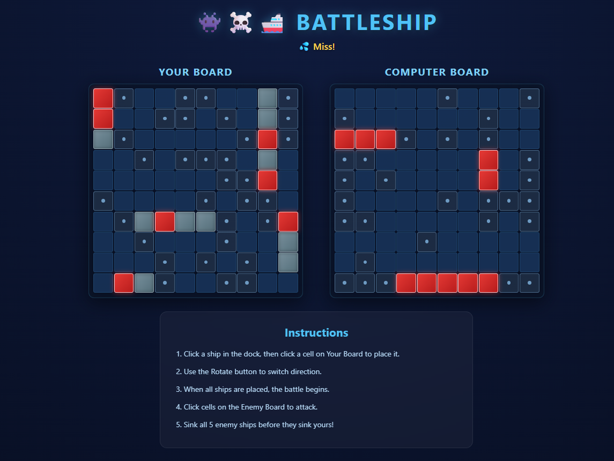

# Project Name
Battleship 
## Technologies Used
1- HTML

2-CSS

3-Js

## Description

A browser-based Battleship game where two players take turns firing at a hidden grid to sink each other's fleet. Built with HTML, CSS, and JavaScript using DOM manipulation and CSS Grid.

## User Stories

1. As a player, I want to see how to play the game so I don't get confused.

2. As a player, I want the ships to be placed automatically so I don't have to do it myself.

3. As a player, I want to see my board and my opponent's board on the screen at the same time.

4. As a player, I want to click on a cell to shoot at my opponent's ship.

5. As a player, I want the game to show me red for a hit and white for a miss so I know what happened.

6. As a player, I want the game to tell me when I sink a ship so I know I'm doing good.

7. As a player, I want to know whose turn it is so we don't both click at the same time.

8. As a player, I want the game to tell me who won when all the ships are sunk.

9. As a player, I want a button to play again after the game ends.

10. As a player, I want the colors to be easy to see and the text to be readable.

## Screenshots

## Credit  

[Code with Ania Kubów](https://youtu.be/Ubh_k18sX4E?si=40ljV9X3B7I11mhqS)